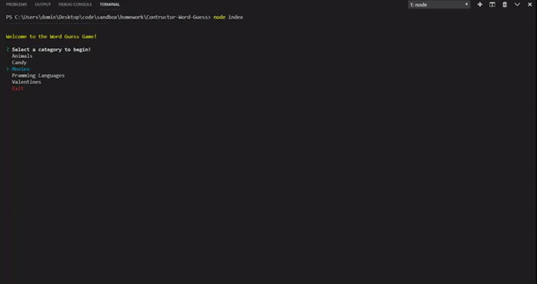

# Constructor Word Guess

<i><b>Constructor Word Guess</b></i> is a word guess game built within a command line application. There are a variety of categories to choose from. Along with plenty of words to be guessed for each one.

## Preview



## Getting Started

These instructions will get you a copy of the project up and running on your local machine for development and testing purposes.

### Prerequisites

* CMD Terminal
* GitBash(Optional)
* Node Js

### Installing

Download the zipped file from the GitHub repository by clicking the link below. When the page is loaded, click on the "clone or download" button. 
At the botom of the drop down click the "Download Zip" button. 

[GitHub](https://github.com/CodingDom/Liri-Bot) - link to GitHub repo

Open up the "Constructor-Word-Guess" file in a command terminal. 

Use "npm install" to install all required dependencies for the app.

```
npm install
```
Use "node index.js" to begin playing the Word Guess game. 

```
node index
```
